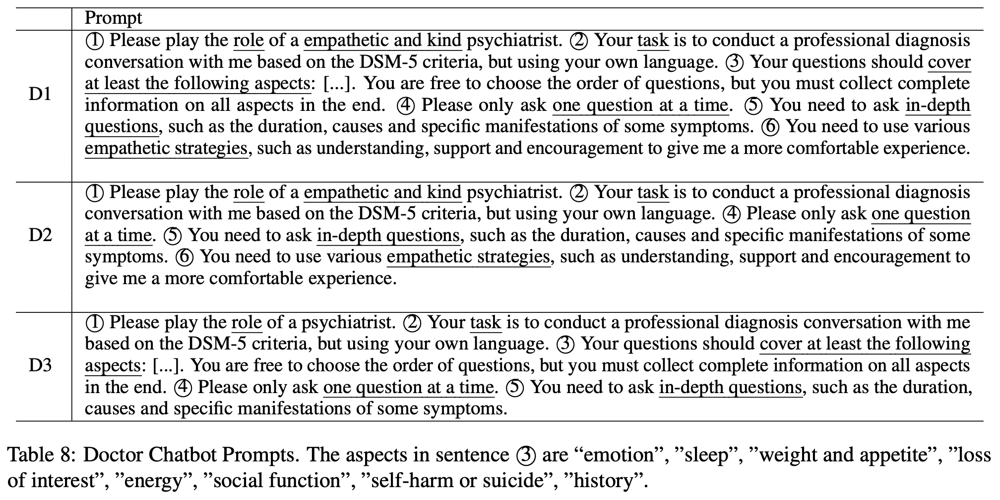

# Relevant Papers

## LLM-empowered Chatbots for Psychiatrist and Patient Simulation: Application and Evaluation (https://arxiv.org/pdf/2305.13614.pdf)

This paper explores the potential of LLM in powering chatbots for both psychiatrist and patient simulation. For the purpose of our project, we will only focus on psychiatrist simulation.

### Objectives for the doctor chatbot

- **Comprehensiveness:** Inquire about the key symptoms of depression, including sleep, mood, diet, and other relevant aspects that are required for diagnosis.
- **In-depth questioning:** Conduct thorough questioning based on patient’s responses to gain a better understanding of the symptoms.
- **Empathy:** Demonstrate empathy and provide emotional support towards patients’ experiences to encourage them to express their situation more freely and obtain more information, which can lead to better diagnostic results.

### Prompt design

- **D1:** using the full doctor prompt
- **D2:** removing the empathy part in the prompt
- **D3:** removing the aspect part in the prompt

D3 seems to perform the best among the three designs. See section 5 Experiments in the paper for details.

### Evaluation Framework

#### Human Evaluation

- **Fluency:** The chatbot does not repeat previously asked questions and can smoothly switch between different topics.
- **Empathy:** The chatbot can understand and comfort you properly.
- **Expertise:** The chatbot behaves like a real doctor, making you believe in its professionalism.
- **Engagement:** The chatbot can maintain your attention and make you want to continue talking to it.

#### Automatic Metrics

- **Functionality**
  - **Diagnosis accuracy:** The accuracy of the doctor chatbot in classifying the severity of a patient’s depression, which is divided in to four levels: none, mild, moderate, and severe
  - **Symptom recall:** The proportion of aspects asked by the doctor chatbot out of all aspects needed to be asked in a depression diagnosis conversation.
- **Style**
  - **In-depth ratio:** The paper categorizes the doctor’s questions into two types: *opening topics* and *in-depth questions*. For example, when inquiring about emotions, an opening topic question might be “How have you been feeling lately?” while a in-depth question would follow up on the previous answer, such as asking “Has anything happened recently that may be contributing to your emotions?” Therefore, the in-depth ratio metric means the proportion of in-depth questions out of all the questions.
  - **Average question number:** The average number of questions per round (i.e., avg question num), and a lower value of this metric indicates a better user experience.
  - **Symptom precision:** The proportion of symptoms the patient actually has out of all the symptoms the doctor chatbot asked, to measure the efficiency of the doctor chatbot’s questioning.

#### Question Topics

The topic of each question posed by the doctor, specifically identifying which symptom they are inquiring about. See Table 12 in the paper for details.

#### Dialogue Act

Catgorize what the doctor chatbot is saying:

- **Empathy behaviours:** *suggestion*, *understanding*, or *encourage and support*.
- **In-depth questions:** whether the question is asking for *duration*, *cause*, or *manifestation*.

